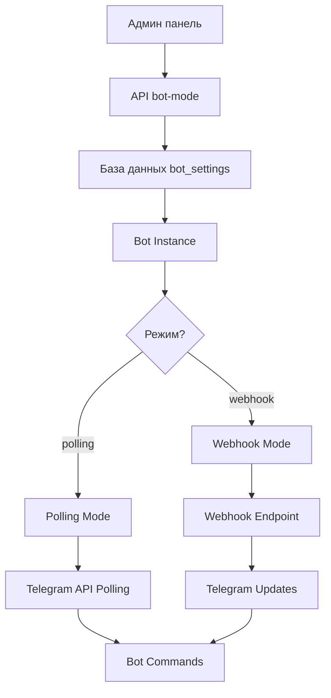

# 🤖 Система управления режимами Telegram бота

> **Гибкое переключение между polling и webhook режимами через админ панель**

## 🎯 Обзор

Система позволяет администраторам динамически переключаться между двумя режимами работы Telegram бота:

- **🔄 Polling режим** - бот опрашивает Telegram сервер
- **🔗 Webhook режим** - Telegram отправляет обновления на ваш сервер

## 🏗️ Архитектура

### **Компоненты системы:**

1. **База данных:** `bot_settings` таблица для хранения настроек
2. **API endpoints:** Управление режимами через REST API
3. **Админ панель:** UI для переключения режимов
4. **Бот сервис:** Динамическая адаптация к режиму
5. **Webhook endpoint:** Обработка входящих обновлений

### **Схема работы:**



## 📊 Настройки в базе данных

### **Таблица `bot_settings`:**

| Ключ | Описание | Возможные значения |
|------|----------|-------------------|
| `bot_mode` | Текущий режим работы | `polling`, `webhook` |
| `bot_status` | Статус бота | `active`, `inactive`, `error` |
| `webhook_url` | URL для webhook | `https://domain.com/api/bot/webhook` |
| `polling_enabled` | Включен ли polling | `true`, `false` |
| `webhook_enabled` | Включен ли webhook | `true`, `false` |
| `auto_restart` | Автоперезапуск при ошибках | `true`, `false` |
| `error_count` | Количество ошибок за час | `0`, `1`, `2`, ... |
| `last_update_time` | Время последнего обновления | ISO timestamp |

## 🔄 Polling режим

### **Преимущества:**
- ✅ Простота настройки
- ✅ Работает в любом окружении
- ✅ Не требует HTTPS
- ✅ Легкая отладка

### **Недостатки:**
- ❌ Больше ресурсов сервера
- ❌ Задержка в ответах (1-3 секунды)
- ❌ Ограничения по количеству запросов

### **Когда использовать:**
- 🛠️ Разработка и тестирование
- 🏠 Локальная разработка
- 🧪 Отладка проблем

## 🔗 Webhook режим

### **Преимущества:**
- ✅ Мгновенные ответы
- ✅ Меньше ресурсов
- ✅ Масштабируемость
- ✅ Рекомендуется Telegram

### **Недостатки:**
- ❌ Требует HTTPS
- ❌ Сложнее настройка
- ❌ Зависимость от стабильности сервера

### **Когда использовать:**
- 🚀 Продакшен среда
- 🌐 Публичные серверы
- ⚡ Высокая нагрузка

## ⚙️ Использование через админ панель

### **Доступ к настройкам:**
1. Войдите как администратор
2. Перейдите в **Админ панель** → `/admin`
3. Найдите секцию **"🤖 Управление Telegram ботом"**

### **Переключение режимов:**

#### **На Polling:**
1. Нажмите **"Включить Polling"**
2. Система автоматически:
   - Остановит webhook (если активен)
   - Удалит webhook из Telegram
   - Запустит polling режим
   - Обновит статус в БД

#### **На Webhook:**
1. Введите **Webhook URL** (например: `https://your-app.vercel.app/api/bot/webhook`)
2. Нажмите **"🧪 Тест"** для проверки URL
3. Нажмите **"Включить Webhook"**
4. Система автоматически:
   - Остановит polling (если активен)
   - Установит webhook в Telegram
   - Обновит настройки в БД

### **Мониторинг:**
- **📊 Текущий статус** - режим и состояние бота
- **🔢 Счетчик ошибок** - количество ошибок за час
- **⏰ Последнее обновление** - время последней активности
- **🔗 Webhook информация** - статус и ошибки webhook

## 🔧 Использование через API

### **Получение текущих настроек:**

```bash
GET /api/admin/bot-mode

# Ответ:
{
  "success": true,
  "currentMode": "polling",
  "botStatus": "active", 
  "settings": {
    "bot_mode": "polling",
    "bot_status": "active",
    "webhook_url": "",
    "error_count": "0"
  },
  "webhookInfo": null
}
```

### **Переключение на polling:**

```bash
POST /api/admin/bot-mode
Content-Type: application/json

{
  "mode": "polling"
}
```

### **Переключение на webhook:**

```bash
POST /api/admin/bot-mode
Content-Type: application/json

{
  "mode": "webhook",
  "webhookUrl": "https://your-app.vercel.app/api/bot/webhook"
}
```

### **Обновление отдельной настройки:**

```bash
POST /api/admin/bot-settings
Content-Type: application/json

{
  "settingKey": "auto_restart",
  "settingValue": "true"
}
```

## 🚀 Развертывание

### **Локальная разработка (Polling):**

```bash
# Настройте .env.local
TELEGRAM_BOT_TOKEN=your-dev-bot-token

# Запустите приложение
npm run dev

# В админ панели выберите Polling режим
```

### **Продакшен на Vercel (Webhook):**

```bash
# 1. Деплой на Vercel
./scripts/deploy-vercel.sh production 1.0.0

# 2. В админ панели:
# - Webhook URL: https://your-app.vercel.app/api/bot/webhook
# - Нажмите "Включить Webhook"

# 3. Или через API:
curl -X POST "https://your-app.vercel.app/api/admin/bot-mode" \
  -H "Content-Type: application/json" \
  -d '{
    "mode": "webhook",
    "webhookUrl": "https://your-app.vercel.app/api/bot/webhook"
  }'
```

## 🔍 Мониторинг и отладка

### **Проверка статуса бота:**

```bash
# Через API
curl "https://your-app.vercel.app/api/admin/bot-mode"

# Через Telegram API
curl "https://api.telegram.org/botYOUR_TOKEN/getWebhookInfo"
```

### **Логи и диагностика:**

1. **Vercel Dashboard** → **Functions** → **View Logs**
2. **Админ панель** → **Управление ботом** → **📋 Логи бота**
3. **Консоль браузера** при работе с админ панелью

### **Частые проблемы:**

#### **Webhook не работает:**
```bash
# Проверьте доступность endpoint
curl "https://your-app.vercel.app/api/bot/webhook"

# Проверьте webhook в Telegram
curl "https://api.telegram.org/botYOUR_TOKEN/getWebhookInfo"

# Проверьте логи в Vercel
```

#### **Polling конфликт:**
```bash
# Ошибка: "409: Conflict: terminated by other getUpdates request"
# Решение: Остановите другие экземпляры бота или переключитесь на webhook
```

## 🧪 Тестирование

### **Тестирование переключения режимов:**

1. **Запустите в polling режиме:**
   - Отправьте `/help` боту
   - Проверьте ответ

2. **Переключите на webhook:**
   - Через админ панель включите webhook
   - Отправьте `/help` боту
   - Проверьте что ответ приходит быстрее

3. **Проверьте логи:**
   - Убедитесь что переключение прошло без ошибок
   - Проверьте счетчик ошибок в админ панели

### **Автоматическое тестирование:**

```bash
# Запуск тестов системы управления ботом
npm test -- src/__tests__/admin/bot-mode-management.test.ts
```

## 🔒 Безопасность

### **Контроль доступа:**
- ✅ Только администраторы могут изменять настройки
- ✅ RLS политики защищают таблицу `bot_settings`
- ✅ Валидация всех входящих данных
- ✅ Логирование всех изменений

### **Webhook безопасность:**
- ✅ Обязательный HTTPS для webhook URL
- ✅ Валидация формата URL
- ✅ Проверка доступности endpoint перед установкой
- ✅ Автоматическое удаление webhook при переключении

## 📋 Миграция

### **Применение схемы базы данных:**

```sql
-- Выполните в Supabase SQL Editor:
\i sql-scripts/add-bot-settings-table.sql
```

### **Настройка начальных значений:**

После применения миграции таблица автоматически заполнится настройками по умолчанию:
- `bot_mode: 'polling'`
- `bot_status: 'inactive'`
- `auto_restart: 'true'`
- И другие...

## 🎯 Лучшие практики

### **Разработка:**
- Используйте **polling режим** для локальной разработки
- Тестируйте переключение режимов на staging
- Мониторьте логи при изменении режимов

### **Продакшен:**
- Используйте **webhook режим** для production
- Настройте мониторинг ошибок
- Включите автоматический перезапуск
- Регулярно проверяйте статус бота

### **Отладка:**
- При проблемах переключитесь на polling
- Проверьте логи в Vercel Dashboard
- Используйте тестовые команды для диагностики

---

## 🆘 Поддержка

**При проблемах:**
- 📧 Email: mvalov78@gmail.com
- 🐛 GitHub Issues: [Создать issue](https://github.com/mvalov78/PokerTracker/issues)
- 📚 Документация: См. другие .md файлы в проекте

**🤖 Удачной настройки бота! Пусть он работает стабильно в любом режиме!** 🚀
