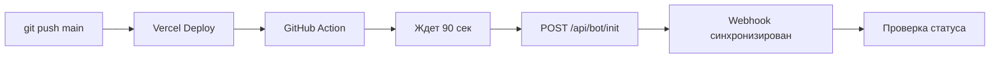

# Автоматическая синхронизация webhook при деплое

**Дата:** 16 октября 2025  
**Версия:** v1.3.3

## Проблема

После каждого деплоя на Vercel нужно было вручную:
1. Открывать `/admin/bot`
2. Нажимать "⚙️ Синхронизировать из .env"
3. Проверять статус

Это неудобно и можно забыть.

## Решение

Создан **GitHub Action** который автоматически:
- ✅ Запускается после каждого пуша в `main`
- ✅ Ждет завершения деплоя на Vercel (90 секунд)
- ✅ Автоматически вызывает `POST /api/bot/init`
- ✅ Синхронизирует webhook из переменной окружения `BOT_WEBHOOK_URL`
- ✅ Проверяет статус и выводит отчет
- ✅ Падает с ошибкой если синхронизация не удалась

## Как это работает



### Файл workflow

`.github/workflows/deploy-and-init-bot.yml`

```yaml
on:
  push:
    branches: [main]
  workflow_dispatch: # Можно запустить вручную
```

### Что делает

1. **Ждет завершения деплоя** (90 секунд)
2. **Синхронизирует webhook:**
   ```bash
   curl -X POST https://poker-tracker-ashy.vercel.app/api/bot/init
   ```
3. **Проверяет результат:**
   - ✅ Webhook URL совпадает с `BOT_WEBHOOK_URL`
   - ✅ `pending_update_count` = 0
   - ✅ Нет ошибок

## Использование

### Автоматический режим (по умолчанию)

Просто делайте `git push main` - все остальное произойдет автоматически:

```bash
git add .
git commit -m "feat: some changes"
git push origin main

# 1. Vercel автоматически деплоит (2-3 минуты)
# 2. GitHub Action ждет 90 секунд
# 3. GitHub Action синхронизирует webhook
# 4. Готово! ✅
```

### Ручной режим

Можно запустить вручную в GitHub:

1. Откройте GitHub → Actions
2. Выберите "Auto-sync Bot Webhook After Deploy"
3. Нажмите "Run workflow"
4. Выберите ветку `main`
5. Нажмите "Run workflow"

### Проверка логов

После каждого пуша:

1. Откройте GitHub → Actions
2. Найдите последний запуск "Auto-sync Bot Webhook After Deploy"
3. Откройте лог

**Вы увидите:**
```
⏳ Ждем завершения деплоя на Vercel...
✅ Деплой должен завершиться
🔗 Синхронизируем webhook из BOT_WEBHOOK_URL...
✅ Webhook успешно синхронизирован!
📋 Режим: webhook
🔗 Webhook URL: https://poker-tracker-ashy.vercel.app/api/telegram/webhook
🔍 Проверяем статус webhook...
✅ Все настроено правильно!
```

## Когда это полезно

### 1. Регулярные деплои
Каждый раз после пуша webhook автоматически синхронизируется.

### 2. Изменение переменных окружения
После изменения `BOT_WEBHOOK_URL` в Vercel:
1. Сделайте любой коммит
2. Пушните в `main`
3. Webhook автоматически обновится

### 3. Восстановление после ошибок
Если webhook сбился:
1. Пушните любой коммит
2. GitHub Action восстановит правильный webhook

### 4. Переключение деплоев
Если переключаетесь между `poker-tracker-ashy` и `poker-tracker-eight`:
1. Обновите `BOT_WEBHOOK_URL` в Vercel
2. Пушните коммит
3. Webhook автоматически обновится

## Преимущества

✅ **Автоматизация** - Не нужно помнить о синхронизации  
✅ **Надежность** - Всегда правильный webhook после деплоя  
✅ **Прозрачность** - Логи в GitHub Actions  
✅ **Контроль** - Можно запустить вручную  
✅ **CI/CD** - Часть пайплайна деплоя  

## Настройка

### Требования

1. ✅ Репозиторий на GitHub
2. ✅ Vercel автоматически деплоит из `main`
3. ✅ Переменная `BOT_WEBHOOK_URL` настроена в Vercel
4. ✅ GitHub Actions включены в репозитории

### Проверка

1. **GitHub Actions включены:**
   - Settings → Actions → General
   - Allow all actions and reusable workflows

2. **Vercel автодеплой настроен:**
   - Vercel Dashboard → Project Settings → Git
   - Production Branch: `main`

3. **Переменная окружения:**
   ```bash
   BOT_WEBHOOK_URL=https://poker-tracker-ashy.vercel.app/api/telegram/webhook
   ```

## Troubleshooting

### Action падает с ошибкой

**Проверьте логи:**
```
❌ Ошибка синхронизации webhook
Ошибка: Failed to set webhook: ...
```

**Решение:**
1. Проверьте `BOT_WEBHOOK_URL` в Vercel
2. Убедитесь что endpoint `/api/telegram/webhook` доступен
3. Проверьте `TELEGRAM_BOT_TOKEN`

### Webhook не синхронизируется

**Проверьте:**
1. Deплой на Vercel завершен успешно
2. GitHub Action запустился (GitHub → Actions)
3. Логи GitHub Action не показывают ошибок
4. 90 секунд достаточно для деплоя (обычно да)

### Нужно больше времени для деплоя

Если деплой занимает больше 90 секунд, увеличьте:

```yaml
- name: Wait for Vercel deployment
  run: sleep 120  # Увеличить до 120 секунд
```

## Ручная синхронизация

Если нужно синхронизировать вручную:

### Через UI
```
https://poker-tracker-ashy.vercel.app/admin/bot
→ Нажать "⚙️ Синхронизировать из .env"
```

### Через curl
```bash
curl -X POST https://poker-tracker-ashy.vercel.app/api/bot/init
```

### Через GitHub Actions
```
GitHub → Actions → "Auto-sync Bot Webhook After Deploy" → Run workflow
```

## Мониторинг

### Проверка статуса
```bash
curl https://poker-tracker-ashy.vercel.app/api/bot/init | jq '.recommendation'
```

Должно вернуть:
```
"✅ Конфигурация корректна"
```

### Проверка webhook в Telegram
```bash
curl https://api.telegram.org/bot<TOKEN>/getWebhookInfo | jq '.result.url'
```

Должно вернуть:
```
"https://poker-tracker-ashy.vercel.app/api/telegram/webhook"
```

## История

### v1.3.3 - 16 октября 2025
- ✅ Создан GitHub Action для автоматической синхронизации
- ✅ Webhook синхронизируется после каждого деплоя
- ✅ Добавлена проверка статуса
- ✅ Документация AUTO_DEPLOY_SYNC.md

### v1.3.2 - 16 октября 2025
- ✅ Создан `/api/bot/init` endpoint
- ✅ Добавлена кнопка "Синхронизировать из .env"

### v1.3.1 - 16 октября 2025
- ✅ Добавлен webhook режим
- ✅ Динамическая страница администрирования

## Рекомендации

1. ✅ Всегда используйте `git push main` для деплоя
2. ✅ Проверяйте логи GitHub Actions после пуша
3. ✅ Если webhook сбился - просто пушните коммит
4. ✅ Используйте `/admin/bot` для мониторинга
5. ✅ Не изменяйте webhook вручную через Telegram API

---

**Автор:** AI Assistant  
**Дата:** 16 октября 2025  
**Статус:** ✅ Работает автоматически

